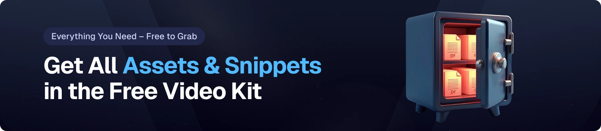

# 🚀 AI Resume Analyzer

<div align="center">
  <br />
    
  <br />
  <div>
    
    
    
    
  </div>
</div>

---

## ✨ Introduction

This is an **AI-powered Resume Analyzer** that I built by following a YouTube tutorial and coding along step-by-step.
The goal of the project was to learn how to combine modern frontend tools with AI integrations to build something practical and useful.

With this app, you can:

* Upload and store resumes
* Get **ATS (Applicant Tracking System) scores**
* Receive personalized **feedback** tailored to job descriptions
* Use a clean, reusable **React + Tailwind UI**

It was a great hands-on learning experience that helped me improve my React, TypeScript, and state management skills.

---

## ⚙️ Tech Stack

* **React** – component-based UI library
* **React Router v7** – for routing and navigation
* **Puter.js** – serverless auth, storage, and AI tools directly in the browser
* **Tailwind CSS** – utility-first styling
* **TypeScript** – strongly typed JavaScript for better tooling and maintainability
* **Vite** – modern frontend build tool for lightning-fast dev experience
* **Zustand** – minimal state management

---

## 🔋 Features

✅ **Authentication** – fully handled in the browser using Puter.js
✅ **Resume Upload & Storage** – save and access resumes securely
✅ **AI Resume Matching** – compare resumes with job listings & get ATS scores
✅ **Reusable UI Components** – modular code for clean development
✅ **Cross-Device Responsive** – works seamlessly on mobile and desktop
✅ **Modern UI/UX** – designed with TailwindCSS + shadcn/ui
✅ **Scalable Codebase** – built with reusability and clarity in mind

---

## 🤸 Quick Start

Follow these steps to run the project locally:

### Prerequisites

* [Git](https://git-scm.com/)
* [Node.js](https://nodejs.org/en)
* [npm](https://www.npmjs.com/)

### Clone the Repository

```bash
git clone https://github.com/girishkumar777/resumeanalyz.git
cd resumeanalyz
```

### Install Dependencies

```bash
npm install
```

### Run the Project

```bash
npm run dev
```

Open **[http://localhost:5173](http://localhost:5173)** in your browser.

---

## 🔗 Assets

All banners and media are stored in the `public/readme` folder.



---


Would you like me to also **add a section at the end highlighting that this project is part of your portfolio** (so recruiters see it as *your* work, not just a copy of a tutorial)?
